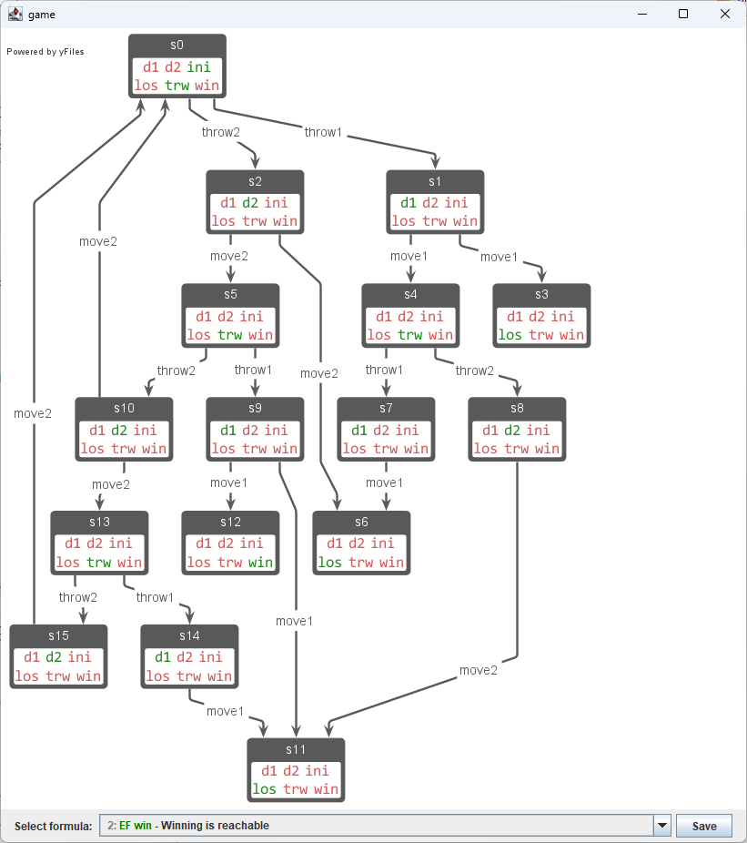
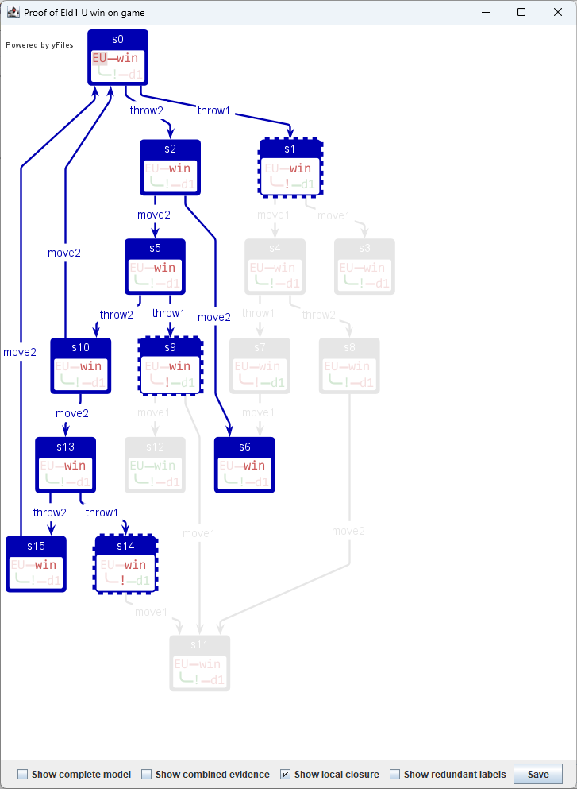
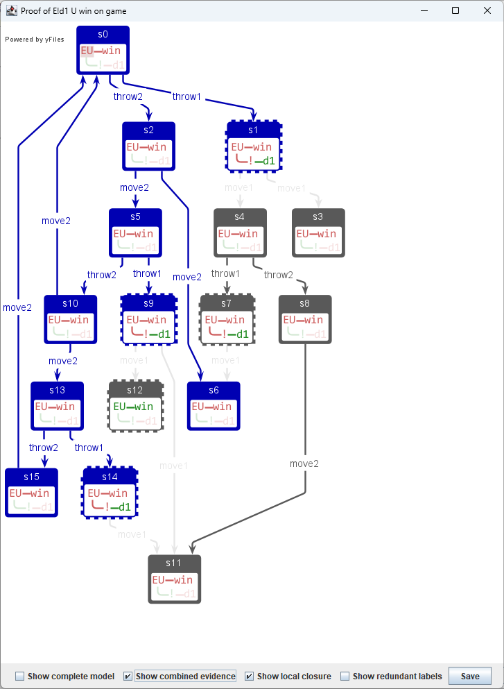

CTLViz Software Artifact
========================

Abstract
-----

This artifact supports the SPIN 2026 paper *Visualising CTL witnesses and counterexamples*. It contains a single Jar file, running under Java 21 or higher, that demonstrates the concept of evidence (witnesses or counterexamples) for CTL formulas and its visualisation, as described in the paper.

The README belongs to CTLViz version 1.2.0. It is available under DOI [`10.5281/zenodo.19168848`](https://doi.org/10.5281/zenodo.19168848).

**Changes with respect to the previous version (1.1.2):**

- The classes `KripkePanel` and `ProofPanel` are relocated to the subpackage `display` so they are exported
- This README contains more information about reusing the artefact

Installing CTLViz
-----

- To install, copy the file `ctlviz-x.y.z.jar` to a directory on your machine, replacing the `x.y.z` by the actual version number

Running CTLViz in demo mode
-----

- To run the artifact, Java 21 (or higher) needs to be installed. There are no further requirements.

- The main class in the jar is the `GameDemo` reported in the paper, consisting of a pre-programmed Kripke structure and a number of CTL formulas:
  
  1. `AF(win|los|ini)`: Every path reaches a winning state, a losing state, or the initial state
  2. `EF win`: Winning is reachable
  3. `E !d1 U win`: Winning is reachable without throwing 1
  4. `EF(trw & AF win)`: There is a reachable state in which you are about to throw and will always win
  5. `EF(trw & AF los)`: There is a reachable state in which you are about to throw and will always lost
  6. `EX EF ini`: There is a cycle back to the initial state
  7. `A (EF los) U win`: Losing always remains reachable until you win
  8. `AX (d1 -> AF los)`: If you initially throw 1, you will certainly lose
  9. `AG EF (win|los)`: Winning or losing always remains reachable
  10. `AG (trw -> EG !(win|los))`: In every reachable state where you are about to throw, it is possible that you will never win or lose
  11. `trw -> !(win|los)`: If you are abole to throw, then you have neither won nor lost
  12. `E !d1 U win`: It is possible to win without throwing 1
  13. `E !d1 U los`: It is possible to lose without throwing 1
  14. `EG (EF win) & !win`: There is a path along which winning remains reachable but is never reached

- To run the tool, invoke the Java Virtual Machine from the directory with the jar:
  
  ```
  java -jar ctlviz-x.y.z.jar
  ```
  
  This will result in a window showing the Kripke structure of the GameDemo:
  
  

- By selecting, e.g. formula 3 (`E !d1 U win` ), a second window pops up showing the evidence (in this case, a counterexample) for the chosen formula on state 0:
  
  
  
  You can select other states or subformulas to see the corresponding evidence for both.

- By checking `Show combined evidence`, you get a different view that combines the evidence of the selected (sub)formula for all states:
  
  

- Other checkboxes give rise to different views, as described in the paper.

Reusing CTLViz
-----

CTLViz offers reuse on three levels:

- **Using the pre-programmed display setup for your own automata and formulas.** For this, you have to
  
  * Construct your own Kripke structure and your own formulas
  * Instantiate a `KripkeDisplay` with that Kripke structure
  * Add formulas to the display using `KripkeDisplay.addFormula`
  * Call `KripkeDisplay.setVisible(true)`
  
  You will get a window displaying the Kripke structure itself, from which you can invoke the model checked on the pre-programmed formulas, exactly as for `GameDemo`. As a template, you can look at the source of `GameDemo`.

- **Reusing the display components of Kripke structures and evidence.** The display components are, respectively, `KripkePanel` and `ProofPanel`, which can be found in the `display` subpackage. These are `JComponents`  and can be used anywhere in your GUI.
  
  * For `KripkePanel`, you just instantiate it with your own Kripke structure; there is no other functionality
  * For `ProofPanel`, you instantiate it with a `Proof` (see below on how to get that), after which you can programmatically select select the state/formula pair that you want to visualise using `setEvidence`. To tune what you see, there are boolean flags `showComplete`, `showExtra`, `showLocal` and `showCombined` with corresponding getters and setters: these have exactly the effect of the four checkboxes on the windows shown above.

- **Generating evidence programmatically.** The CTLViz library contains core model checking functionality that generates the evidence and proofs as discussed in the paper. All relevant classes can be found in the subpackage `model` . The core consist of the class `Proof` objects, from which, once computed, `Evidence` for individual formulas can be retrieved. To use:
  
  * Instantiate a `Proof` for a given Kripke structure and formula;
  * Immediately call `compute` on it
  * Retrieve individual `Evidence` objects using `get`

As a further guide on how to use this functionality, the jar includes fully documented sources, except where those had to be obfuscated to meet the license requirements of the [YFiles for Java library](https://www.yworks.com/products/yfiles-for-java) used for the graph rendering.
